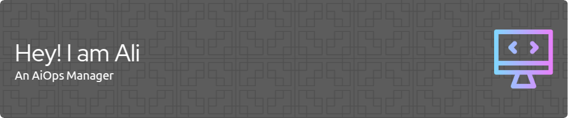

[//]: # (<h1 align="center">Hi 👋, I'm Ali</h1>)

[//]: # (<h3 align="center">A passionate Ai Operations Manager from Pakistan</h3>)

- 🌱 I’m currently learning **AiOps**

- 📫 Reach me at **ali.cyberdefense@gmail.com**

<h2>👨‍💻 Selenium on Cloud</h2>

  - [Setting up Selenium on AWS](https://github.com/ali-cyberdefense/PythonSelenium/tree/main/Setting%20up%20Selenium%20on%20AWS)
  - [Taking Screenshot](https://github.com/ali-cyberdefense/PythonSelenium/tree/main/Taking%20Screen%20Shot)
  - [Taking Screenshots & Uploading on S3](https://github.com/ali-cyberdefense/PythonSelenium/tree/main/Taking%20Screenshots%20%26%20Uploading%20on%20S3)
  - [Selenium Grid on EC2 with single Node](https://github.com/ali-cyberdefense/PythonSelenium/tree/main/Selenium%20Grid%20on%20EC2%20with%20single%20Node)
  - [Monitor Web App Performance with Selenium & CloudWatch](https://github.com/ali-cyberdefense/PythonSelenium/tree/main/Monitor%20Web%20App%20Performance%20with%20Selenium%20%26%20CloudWatch)
  - [Form Submission & Storing Result on RDS](https://github.com/ali-cyberdefense/PythonSelenium/tree/main/Form%20Submission%20%26%20Storing%20Result%20on%20RDS)
  - [Error Reporting with Selenium & AWS SNS](https://github.com/ali-cyberdefense/PythonSelenium/tree/main/Error%20Reporting%20with%20Selenium%20%26%20AWS%20SNS)
  - [Continuous Integration with Jenkis & Selenium](https://github.com/ali-cyberdefense/PythonSelenium/tree/main/Continuous%20Integration%20with%20Jenkis%20%26%20Selenium)
  - [Headless Selenium Test on EC2](https://github.com/ali-cyberdefense/PythonSelenium/tree/main/Headless%20Selenium%20Test%20on%20EC2)

<h2>📺 Python Automation on Cloud</h2>

- [Automate AWS S3 Operations](https://github.com/ali-cyberdefense/PythonProjects/tree/main/Automate%20AWS%20S3%20Operations)
- [Cloud Watch Metrics & Dashboard](https://github.com/ali-cyberdefense/PythonProjects/tree/main/Cloud%20Watch%20Metrics%20%26%20Dashboard)
- [Configure AWS SDK & Develop a Stack](https://github.com/ali-cyberdefense/PythonProjects/tree/main/Configure%20AWS%20SDK%20%26%20Develop%20a%20Stack)
- [Create & Configure Elastic Load Balancer (ELB)](https://github.com/ali-cyberdefense/PythonProjects/tree/main/Create%20%26%20Configure%20Elastic%20Load%20Balancer%20(ELB))
- [Create RDS Instance & Take Backup](https://github.com/ali-cyberdefense/PythonProjects/tree/main/Create%20RDS%20Instance%20%26%20Take%20Backup)
- [Start-Stop-Monitor EC2](https://github.com/ali-cyberdefense/PythonProjects/tree/main/Start-Stop-Monitor%20EC2)

<h2>Languages and Tools:</h2>

                  

<h2> 🤳 Connect with me:</h2>

